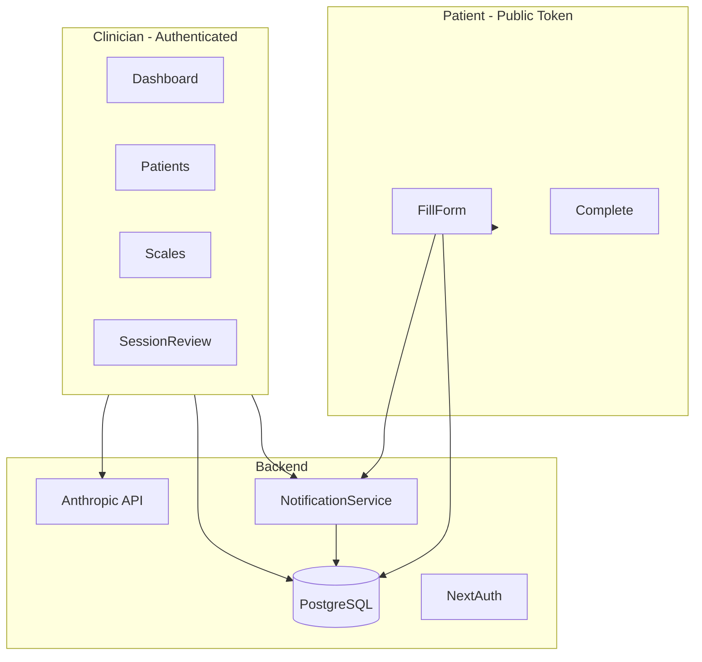

# APAS — Project Summary

**Product name:** APAS (Clinical Overwatch)  
**Repository:** `psychology-test`  
**Last updated:** July 2026

---

## What this project is

APAS is a clinical assessment platform for psychologists and clinicians. It lets practitioners:

- Manage a de-identified patient caseload
- Send secure questionnaire links to patients (no patient login required)
- Score validated instruments automatically (PHQ-9, GAD-7, BDI-II, and more)
- Review severity alerts, item-level responses, and AI-generated clinical summaries
- Build custom scales and severity thresholds

Patients complete assessments on mobile-friendly forms via a unique token link. Clinicians work inside an authenticated dashboard with alerts, notifications, and session review tools.

---

## Tech stack

| Layer | Technology |
|-------|------------|
| Framework | Next.js 14 (App Router) |
| Language | TypeScript |
| Database | PostgreSQL via Prisma |
| Auth | NextAuth.js (credentials + email verification) |
| UI | shadcn/ui, Tailwind CSS 4, Geist font |
| Tables | TanStack Table v8 |
| Charts | Recharts |
| AI summaries | Anthropic Claude API (`/api/narrative`) |
| Toasts | Sonner |
| Tests | Jest (34 tests across 7 suites) |

---

## User flows

```
/auth/signin ──┬──> /dashboard
/auth/signup ──┘         │
/auth/verify-email       ├──> /patients ──> /patients/[id] ──> /patients/[id]/sessions/[sessionId]
                         ├──> /scales ──> /scales/[id]
                         │              └──> /scales/new (wizard)
                         │
Patient (no login) ──────┴──> /fill/[token] ──> /fill/[token]/complete
```

### Clinician dashboard
- **Dashboard** — stat cards, alert feed for high-severity results, caseload table
- **Patients** — searchable patient list, profile with score history chart, session management
- **Session detail** — item scores, severity badges, AI clinical summary, Mark Reviewed / Escalate actions
- **Scales** — library instruments (read-only) + custom scales; 3-step builder for new scales

### Patient-facing
- Token-based questionnaire at `/fill/[token]` (step-by-step on mobile)
- Completion page with confirmation
- Invalid/expired link handling

---

## Data model (high level)

- **User** — clinician accounts
- **Patient** — anonymous ID (e.g. P-001), optional display name
- **Scale / ScaleItem / SeverityThreshold** — questionnaires and scoring rules
- **AssessmentSession** — pending/completed/expired link with token + expiry
- **QuestionnaireResponse** — scores, severity, `reviewedAt`, `escalatedAt`
- **Notification** — in-app alerts with deduplication and deep links

### Library scales (seeded)
PHQ-9, GAD-7, BDI-II, DASS-21, AUDIT, PCL-5

---

## Work completed

### 1. UI upgrade (Phases 0–8)

A full design-system refresh documented in [`docs/UI_UPGRADE_PLAN.md`](UI_UPGRADE_PLAN.md):

- Design tokens, shared layout components (`PageHeader`, `EmptyState`, `SectionHeader`, auth shell)
- Responsive sidebar with collapse, dashboard header, dark mode toggle
- Dashboard stat cards, alert feed, caseload section
- Patient list, profile, session tables with status badges
- Scale library, detail pages, new-scale wizard
- Patient questionnaire: fill shell, step form, option cards, metadata/OG, loading states
- Toasts, lazy-loaded charts, accessibility (`aria-live`, focus rings)

### 2. In-app notifications

End-to-end notification system:

- **Schema:** `Notification` model + `NotificationType` enum (completed, severity, SI, link expiry, login, etc.)
- **Service:** [`lib/notifications.ts`](../lib/notifications.ts) — create, dedupe, reconcile, list, mark read, resolve unreviewed
- **API:** `GET/PATCH /api/notifications`
- **Triggers:** questionnaire submit, daily login, link expiry reconciliation, session reviewed
- **UI:** notification bell in header, expandable items, “View session” / “View patient” links
- **Tests:** 9 notification unit tests

### 3. Header menus (notification bell + account)

Radix Popover/Dropdown positioned panels off-screen in the sticky header. Replaced with a custom [`HeaderMenu`](../components/layout/header-menu.tsx):

- Local state, absolute positioning below trigger (no portal)
- Click-outside and Escape to close
- Used for notification bell and avatar account menu

### 4. TanStack Table migration

All data tables migrated from a basic `DataTable` wrapper to a shared TanStack Table kit:

| Surface | Component |
|---------|-----------|
| Dashboard caseload | `caseload-table.tsx` |
| Patients list | `patient-list-table.tsx` |
| Patient sessions | `patient-sessions-table.tsx` |
| Session item scores | `item-scores-table.tsx` |
| Scale thresholds | `scale-thresholds-table.tsx` |
| Scales library + my scales | `scales-table.tsx` |

**Shared kit** (`components/data-table/`):
- Sortable column headers
- Client-side pagination (10/20/50 rows)
- Search on patients and scales tables
- Mobile card fallback from the same table instance
- Clickable rows with keyboard support

**Fixes applied during migration:**
- Removed blank “actions” column (chevron merged into last data column)
- Full-width header background on `<thead>`
- `"use client"` on section wrappers to fix React Client Manifest errors
- Removed invalid `<Link>` inside `<tr>` that caused column misalignment

### 5. Questionnaire & content fixes

- BDI-II description split: scale summary vs. instructions on separate lines
- AI narrative route uses Claude API (model must be kept current — retired models return 404)

### 6. Session review actions

- **Mark Reviewed** — sets `reviewedAt`, clears unreviewed notifications
- **Escalate to Supervisor** — sets `escalatedAt` (audit flag; no email/supervisor workflow yet)

---

## Key directories

```
app/
  (dashboard)/     # Clinician pages (dashboard, patients, scales)
  api/             # REST routes (auth, patients, scales, fill, notifications, narrative)
  auth/            # Sign in, sign up, verify email
  fill/            # Patient questionnaire (public, token-based)

components/
  data-table/      # TanStack Table kit
  dashboard/       # Stat cards, alerts, caseload
  layout/          # Sidebar, header, shell, HeaderMenu
  notifications/   # Bell, notification rows
  patients/        # List, profile, sessions
  questionnaire/   # Patient fill flow
  scales/          # Library, wizard, thresholds
  sessions/        # Charts, narrative, item scores

lib/
  notifications.ts # Notification service
  alert-rules.ts   # Severity / SI detection
  seed-scales.ts   # Library scale definitions
  patient-summary.ts
  scoring-engine.ts

prisma/
  schema.prisma
  migrations/
```

---

## Environment variables

| Variable | Purpose |
|----------|---------|
| `DATABASE_URL` | PostgreSQL connection |
| `NEXTAUTH_SECRET` | Session encryption |
| `NEXTAUTH_URL` | App base URL |
| `ANTHROPIC_API_KEY` | AI clinical summaries |

---

## Running locally

```bash
yarn install
npx prisma migrate deploy
npx prisma db seed   # optional: library scales
yarn dev
```

Tests: `yarn test`  
Build: `yarn build` (if stale cache errors: `rm -rf .next && yarn dev`)

---

## Testing coverage

| Area | Test file |
|------|-----------|
| Alert rules | `__tests__/lib/alert-rules.test.ts` |
| Notifications | `__tests__/lib/notifications.test.ts` |
| Scale scoring | `__tests__/lib/scale-scoring.test.ts` |
| Tokens / passwords / anonymous IDs | `__tests__/lib/*.test.ts` |

---

## Known limitations & follow-ups

1. **AI summaries** — require a valid Anthropic model ID in `app/api/narrative/route.ts`; retired models cause “Summary unavailable”
2. **Escalate to Supervisor** — timestamp only; no supervisor role, email, or queue yet
3. **Pagination** — client-side only (fine for typical caseload sizes)
4. **Server-side table filtering** — not implemented; all list data loaded on page render

---

## Architecture diagram



---

## Summary

APAS is a production-shaped clinical assessment tool: secure patient links, automated scoring on validated instruments, severity alerting, AI-assisted review summaries, and a polished clinician UI. Recent work focused on notifications, responsive data tables, header UX fixes, and completing the patient questionnaire and dashboard polish phases.
